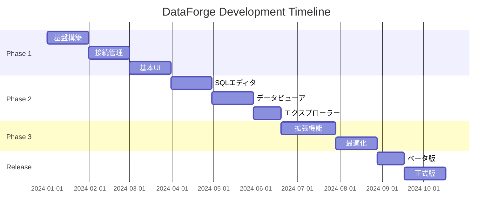

# DataForge 実装ロードマップ

## 開発フェーズ概要

## Phase 1: MVP実装 (3ヶ月)

### Sprint 1: プロジェクト基盤 (2週間)
- [x] プロジェクト初期設定
- [x] 基本的なTauri-React通信の実装
- [x] UIコンポーネントライブラリ設定
- [x] ビルドパイプライン構築
- [x] 開発環境ドキュメント作成

**成果物**:
- 基本的なアプリケーション骨格
- Hello World レベルの動作確認

### Sprint 2: データベース接続基盤 (2週間)
- [x] データベースアダプター設計
- [x] PostgreSQL接続実装
- [x] 接続プール実装
- [x] エラーハンドリング基盤
- [x] 接続テスト実装

**成果物**:
- PostgreSQLへの接続が可能
- 基本的なクエリ実行

### Sprint 3: 接続管理UI (2週間)
- [x] 接続プロファイル画面
- [x] 接続設定フォーム
- [x] 接続テスト機能
- [x] プロファイル保存（暗号化）
- [x] 接続状態表示
- [x] プロファイル削除機能
- [x] 接続タイムアウト設定
- [x] 接続キャンセル機能

**成果物**:
- 接続プロファイルの作成・保存・接続・削除
- セキュアなパスワード管理（macOSキーチェーン統合）
- 接続管理の完全な機能

### Sprint 4: 基本レイアウト (2週間)
- [ ] メインウィンドウレイアウト
- [ ] ペイン分割システム
- [ ] タブシステム
- [ ] サイドバー（エクスプローラー用）
- [ ] ステータスバー

**成果物**:
- 基本的なアプリケーションレイアウト

### Sprint 5: SQLエディタ基本 (2週間)
- [ ] Monaco Editor統合
- [ ] SQL シンタックスハイライト
- [ ] 基本的なオートコンプリート
- [ ] クエリ実行機能
- [ ] エラー表示

**成果物**:
- SQLの記述と実行が可能

### Sprint 6: 結果表示 (2週間)
- [ ] テーブルコンポーネント
- [ ] ページネーション
- [ ] ソート機能
- [ ] データ型別表示
- [ ] CSVエクスポート

**成果物**:
- クエリ結果の表示とエクスポート

## Phase 2: コア機能実装 (2ヶ月)

### Sprint 7-8: データベースエクスプローラー (3週間)
- [ ] データベース階層表示
- [ ] テーブル/ビュー一覧
- [ ] カラム情報表示
- [ ] インデックス情報
- [ ] クイックアクション（SELECT生成等）
- [ ] メタデータキャッシュ

**成果物**:
- データベース構造の可視化と探索

### Sprint 9-10: MySQL/SQLite対応 (3週間)
- [x] MySQLアダプター実装
- [x] SQLiteアダプター実装
- [ ] 方言別SQL対応
- [x] 接続設定UI拡張
- [ ] データベース別機能調整

**成果物**:
- 3つの主要DBへの対応

### Sprint 11: クエリ管理 (2週間)
- [ ] クエリ履歴機能
- [ ] お気に入りクエリ
- [ ] クエリタブ管理
- [ ] 実行履歴表示
- [ ] クエリ統計情報

**成果物**:
- クエリの効率的な管理

### Sprint 12: UI/UX改善 (2週間)
- [ ] ダークモード実装
- [ ] キーボードショートカット
- [ ] 設定画面
- [ ] 国際化（i18n）基盤
- [ ] レスポンシブ調整

**成果物**:
- 使いやすさの向上

## Phase 3: 品質向上と拡張 (2ヶ月)

### Sprint 13-14: パフォーマンス最適化 (3週間)
- [ ] 大量データ処理（ストリーミング）
- [ ] 仮想スクロール実装
- [ ] クエリキャンセル機能
- [ ] メモリ使用量最適化
- [ ] 起動時間短縮

**成果物**:
- 大規模データベースでの実用性

### Sprint 15: データ編集機能 (2週間)
- [ ] インライン編集
- [ ] INSERT/UPDATE/DELETE UI
- [ ] トランザクション管理
- [ ] 変更確認ダイアログ
- [ ] ロールバック機能

**成果物**:
- GUIでのデータ操作

### Sprint 16: インポート/エクスポート拡張 (2週間)
- [ ] JSON形式対応
- [ ] Excel形式対応
- [ ] SQL文生成
- [ ] バッチインポート
- [ ] 進捗表示

**成果物**:
- 多様なデータ形式への対応

### Sprint 17: セキュリティ強化 (1週間)
- [ ] SSL/TLS接続実装
- [ ] キーチェーン統合テスト
- [ ] セキュリティ監査
- [ ] 脆弱性対策

**成果物**:
- エンタープライズレベルのセキュリティ

## Phase 4: リリース準備 (1ヶ月)

### Sprint 18-19: テストとバグ修正 (2週間)
- [ ] ユニットテスト拡充
- [ ] 統合テスト実装
- [ ] E2Eテスト基盤
- [ ] バグ修正
- [ ] パフォーマンステスト

### Sprint 20: ドキュメントとパッケージング (2週間)
- [ ] ユーザーマニュアル作成
- [ ] APIドキュメント
- [ ] インストーラー作成
- [ ] 自動更新機能
- [ ] リリースノート作成

## マイルストーン

### M1: アルファ版 (Phase 1完了時)
- ✅ 基本的な接続とクエリ実行
- ✅ 最小限のUI
- ✅ PostgreSQL対応

### M2: ベータ版 (Phase 2完了時)
- ✅ 3つのDB対応
- ✅ フル機能のエディタ
- ✅ データベースエクスプローラー
- ✅ 基本的なデータ管理

### M3: RC版 (Phase 3完了時)
- ✅ パフォーマンス最適化
- ✅ データ編集機能
- ✅ セキュリティ強化
- ✅ 安定性確保

### M4: 正式版 1.0 (Phase 4完了時)
- ✅ 完全なテストカバレッジ
- ✅ ドキュメント完備
- ✅ インストーラー提供
- ✅ プロダクション対応

## 成功基準

### 技術指標
- 起動時間: < 2秒
- メモリ使用: < 100MB (idle)
- クエリオーバーヘッド: < 10ms
- バンドルサイズ: < 50MB

### 品質指標
- テストカバレッジ: > 80%
- クラッシュ率: < 0.1%
- 応答時間: < 100ms (95%ile)

### ユーザー指標
- インストール成功率: > 99%
- 初回起動成功率: > 99%
- 主要タスク完了率: > 95%

## リスクと対策

### 技術的リスク
| リスク | 影響 | 対策 |
|--------|------|------|
| Tauriの制限 | 高 | 早期プロトタイプで検証 |
| パフォーマンス問題 | 中 | 定期的な性能測定 |
| DB互換性 | 中 | 段階的な対応 |

### スケジュールリスク
| リスク | 影響 | 対策 |
|--------|------|------|
| 見積もり誤差 | 中 | バッファ期間確保 |
| 依存関係 | 低 | 並行開発可能な設計 |

## 次のステップ

1. **即座に開始**:
   - Tauri + React の基本セットアップ
   - UIコンポーネントライブラリの選定と設定
   - PostgreSQL接続のプロトタイプ

2. **1週間以内**:
   - 詳細なタスク分解
   - 開発環境の統一
   - CI/CD パイプライン構築

3. **2週間以内**:
   - 最初のデモ版作成
   - フィードバック収集
   - 計画の調整